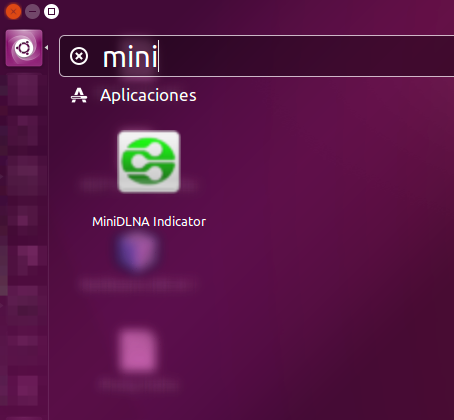
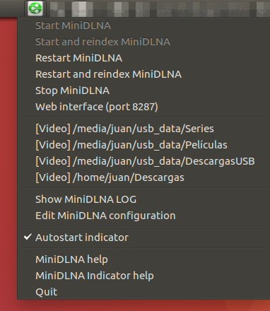
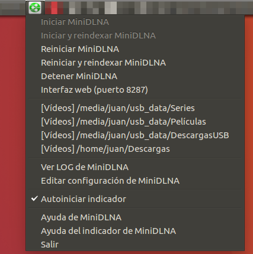

# MiniDLNA Indicator

[](https://landscape.io/github/okelet/minidlnaindicator/master)

This indicator allows you to launch an instance of [MiniDLNA](https://help.ubuntu.com/community/MiniDLNA)
as a normal user, without the need to edit configuration files as `root`, or restart by command the
application if you have changed the configuration.
 
Some of the features this indicator provides are:

* Detect if the process has died, using a background thread
* Auto generation of a port and uuid to avoid conflicts with the default configuration
  ([check this](https://spremi.wordpress.com/2014/06/30/minidlna-multiple-instances/) to know the problem about uuid)
* Auto configuration when first run (adding the pictures, music, videos and downloads folder
of the user, if the exist, and generating a random, non-default, port)

Tested operating systems:

- [Ubuntu 16.04 (Xenial Xerus)](http://www.ubuntu.com)
- [Linux Mint 17.3 (Rosa)](https://www.linuxmint.com)
- [Fedora 26](https://getfedora.org) (with `libappindicator-gtk3` package and [KStatusNotifierItem/AppIndicator Support](https://extensions.gnome.org/extension/615/appindicator-support/) Gnome Shell extension)

It should work with any operating system that supports Python 3.5+, AppIndicator and the required dependencies. If you have problems,
please, open an issue.


Tested from these devices (tests from more devices are welcome):
 
* [Samsung UE32F5500 TV](http://www.samsung.com/nl/consumer/tv-audio-video/televisions/led-tv/UE32F5500AWXXN)
* [Android BubbleUPnP](https://play.google.com/store/apps/details?id=com.bubblesoft.android.bubbleupnp)


## What is MiniDLNA?

In brief, MiniDLNA is a small program that allows you to share multimedia content (audio, video, pictures, etc.) easily with
[DLNA](https://en.wikipedia.org/wiki/Digital_Living_Network_Alliance)/[UPnP](https://en.wikipedia.org/wiki/Universal_Plug_and_Play)
compatible devices (for example, smart TVs, phones, XBMC, etc.). This also could be done with some type of share services,
like Windows/Samba/CIFS, NFS, etc. but DLNA is easier to configure (you just need to run the program and select the folders 
you want to share); it is faster, no need to configure security. 


## Requirements

You will need this software to run the indicator, considering a standard initial installation of Ubuntu 16.04:

```
sudo apt install minidlna python3-pip python3-gi python3-yaml python3-psutil
```


## Instalation

No `deb` or `rpm` packages available; only from Github; if someone wants to contribute, it will be welcome.

Although the application is ready to publish it on PyPi, and perhaps, it would be easy to create a `deb` or `rpm`, 
installation, must be done using `pip` with this repository:

```
python3 -m pip install --upgrade --user git+https://github.com/okelet/minidlnaindicator.git
```

`pip` will create a shortcut in the applications menu.


## Configuration

The configuration is very basic. It will detect an existing user configuration in the `~/.minidlna/minidlna.conf`
file, check it, and use it. If it doesn't exist, it will generate a new one with the user images, music, videos and 
downloads folder of the current user.

The default application configuration, will launch the MiniDLNA process when the indicator starts, and it will
be stopped when the indicator finishes. Also, the own indicator will configure itself to run on every user logon.
All these 3 settings can be changed from the indicator configuration menu.

The MiniDLNA configuration has to be done by hand, but there are some shortcuts to open the file and edit it. You can also
open from the menu the LOG. If you change the configuration, please remember to restart the MiniDLNA process.


## How it looks

Entry in the applications menu (Ubuntu 16.04):



Indicator menu:



Indicator menu (in spanish):




## TODO

* Translators needed
* Update system (from GitHub?)
* Detect external MiniDLNA configuration changes
* Allow some basic MiniDLNA configuration (media folders, port)


## Type checking

Validated with MyPy:

```
mypy --python-version 3.5 --ignore-missing-imports --strict . 
```


## Me

Website (in spanish): https://okelet.github.io

Email: okelet@gmail.com


## Credits

Icons from:

* http://www.easyicon.net/language.en/1090748-dlna_icon.html
* http://www.easyicon.net/language.en/1088952-dlna_icon.html
